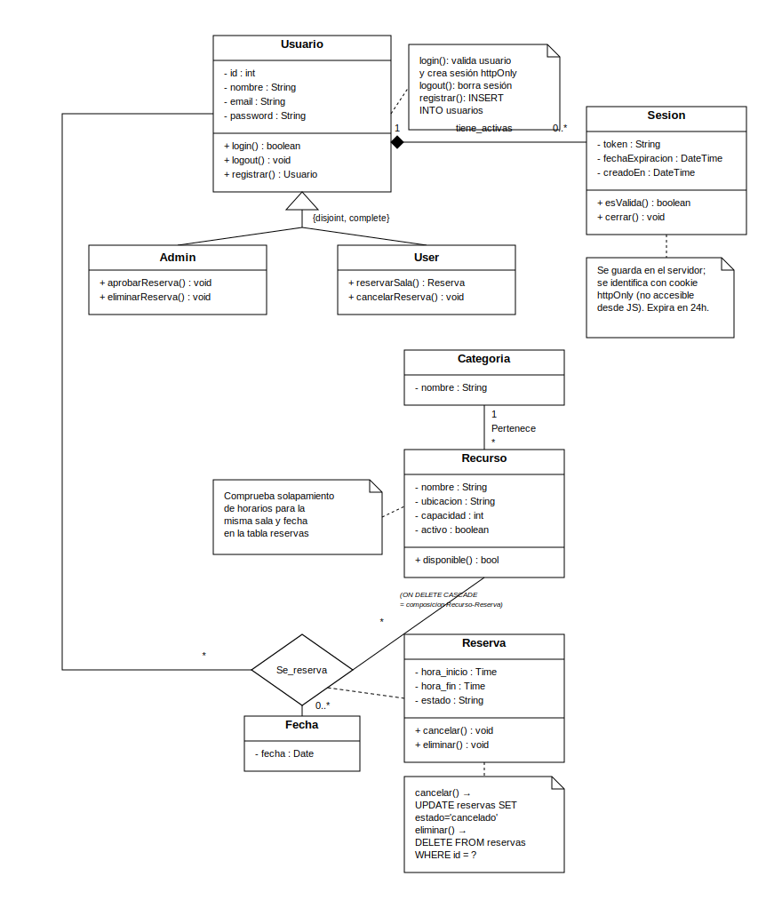

# ReserveHub

Sistema de reservas de recursos universitarios — proyecto final ATSWM.

**Grupo:** Arnau Oller · Sergi Adrià · Daniel Jan Lanero

---

## Índice

1. [Estructura del proyecto](#1-estructura-del-proyecto)
2. [Ejecución local — MySQL ya instalado](#2-ejecución-local--mysql-ya-instalado)
3. [Instalación desde cero](#3-instalación-desde-cero)
4. [Verificar las tablas en MySQL](#4-verificar-las-tablas-en-mysql)
5. [Modelo de datos](#5-modelo-de-datos)
6. [Endpoints de la API](#6-endpoints-de-la-api)
7. [Autenticación](#7-autenticación)
8. [Despliegue en Azure](#8-despliegue-en-azure)
9. [Paginación de salas (UI)](#9-paginación-de-salas-ui)

---

## 1. Estructura del proyecto

```
reservehub/
├── app.py               ← punto de entrada Flask
├── db.py                ← conexión a MySQL y helper query_db
├── auth.py              ← login, registro, logout y decoradores de auth
├── usuarios.py          ← CRUD de usuarios
├── categorias.py        ← CRUD de categorías
├── recursos.py          ← CRUD de recursos
├── reservas.py          ← CRUD de reservas
├── sesiones.py          ← gestión de sesiones activas (admin)
├── requirements.txt     ← dependencias Python
├── .env.example         ← plantilla de variables de entorno
├── imgs/                ← imágenes de las salas (servidas en /imgs/<nombre>)
├── static/
│   ├── css/styles.css
│   └── js/
│       ├── app.js       ← lógica de la SPA principal (login, reservas, etc.)
│       └── admin.js     ← lógica del panel de administración
├── templates/
│   ├── index.html       ← SPA principal
│   └── admin.html       ← panel de administración (ruta /admin)
└── scripts/
    ├── schema.sql                      ← DDL de la base de datos
    ├── seed.py                         ← datos de prueba
    └── fix_numero_sala_default.sql     ← fix puntual: numero_sala de las 5 salas seed antiguas
```

---

## 2. Ejecución local — MySQL ya instalado

Si ya tienes MySQL instalado y la base de datos `reservehub` creada con el schema aplicado, sigue estos pasos:

**Paso 1 — Crear el entorno virtual**

```bash
cd reservehub/
python -m venv venv
```

**Paso 2 — Activar el entorno e instalar dependencias**

```bash
# Windows
venv\Scripts\activate

# Linux / Mac
source venv/bin/activate
```

```bash
pip install -r requirements.txt
```

**Paso 3 — Crear el fichero `.env`**

```bash
# Windows
copy .env.example .env

# Linux / Mac
cp .env.example .env
```

Abre `.env` y rellena tus credenciales:

```
FLASK_ENV=development
SECRET_KEY=una-clave-secreta-larga
DB_HOST=localhost
DB_USER=root
DB_PASS=tu_contraseña_mysql
DB_NAME=reservehub
```

**Paso 4 — Cargar datos de prueba**

```bash
python scripts/seed.py
```

Crea automáticamente estas cuentas:

| Email                | Contraseña | Rol   |
| -------------------- | ---------- | ----- |
| admin@reservehub.com | admin123   | admin |
| user@reservehub.com  | user123    | user  |

`seed.py` usa `INSERT IGNORE`, así que solo inserta filas en una base de datos vacía — no actualiza filas ya existentes. Si tu base de datos se seedeó con una versión antigua del script (las 5 salas de ejemplo aparecen sin `numero_sala` en el panel admin), ejecuta una vez:

```bash
mysql -u root -p reservehub < scripts/fix_numero_sala_default.sql
```

**Paso 5 — Arrancar el servidor**

```bash
python app.py
```

Abrir en el navegador: `http://localhost:5000`

---

## 3. Instalación desde cero

Si todavía no tienes la base de datos creada, añade este bloque **antes** del Paso 4 anterior.

**Abrir el cliente MySQL**

```bash
mysql -u root -p
```

**Crear la base de datos y aplicar el schema**

```sql
CREATE DATABASE IF NOT EXISTS reservehub;
USE reservehub;
SOURCE scripts/schema.sql;
exit
```

Después de esto, continúa desde el **Paso 4** de la sección anterior.

---

## 4. Verificar las tablas en MySQL

Una vez aplicado el schema y el seed, puedes comprobar que todo está bien entrando al cliente MySQL (`mysql -u root -p`) y ejecutando:

**Ver las tablas creadas**

```sql
USE reservehub;
SHOW TABLES;
```

Resultado esperado:

```
+----------------------+
| Tables_in_reservehub |
+----------------------+
| categorias           |
| recursos             |
| reservas             |
| sesiones             |
| usuarios             |
+----------------------+
```

**Ver la estructura de cada tabla**

```sql
DESCRIBE usuarios;
DESCRIBE categorias;
DESCRIBE recursos;
DESCRIBE reservas;
DESCRIBE sesiones;
```

**Ver el contenido tras ejecutar el seed**

```sql
-- usuarios de prueba (deben salir 2 filas)
SELECT id, nombre, email, rol FROM usuarios;

-- categorías (deben salir 4 filas)
SELECT * FROM categorias;

-- recursos (deben salir 5 filas)
SELECT id, nombre, disponible, capacidad FROM recursos;

-- reservas de ejemplo
SELECT id, recurso_id, fecha_reserva, hora_inicio, hora_fin, estado FROM reservas;
```

**Ver datos en formato vertical** (más cómodo con muchas columnas)

```sql
SELECT * FROM reservas\G
SELECT * FROM usuarios\G
```

---

## 5. Modelo de datos

Diagrama de clases UML 2.0 del modelo de datos, con `Usuario`, `Recurso` y `Fecha` participando en una única asociación ternaria `Se_reserva` (rombo) y `Reserva` como clase de asociación; incluye también roles (`Admin`/`User`), disponibilidad y la entidad `Sesion`:



**Cardinalidades:**

- Una categoría puede tener cero o más recursos (`||--o{`).
- Un usuario puede tener cero o más reservas y cero o más sesiones activas.
- Un recurso puede aparecer en cero o más reservas.

**Integridad referencial (ON DELETE):**

- `reservas` → CASCADE en `usuario_id` y `recurso_id`: si se elimina un usuario o recurso, sus reservas se eliminan también.
- `sesiones` → CASCADE en `usuario_id`: las sesiones se eliminan al borrar el usuario.
- `recursos` → RESTRICT en `categoria_id`: no se puede borrar una categoría que tenga recursos asociados.

**Índices adicionales:**

- `idx_fecha_recurso (fecha_reserva, recurso_id)` en `reservas` → acelera la comprobación de solapamiento de franjas.
- `idx_token` y `idx_expiration` en `sesiones` → acelera la validación del token de sesión en cada petición.

---

## 6. Endpoints de la API

Todos los endpoints van con el prefijo `/api`. Los protegidos requieren sesión activa: el navegador la envía automáticamente mediante la cookie httpOnly `reservehub_session` que pone `/api/auth/login` (no hace falta añadir cabeceras manualmente). Como alternativa para clientes no-navegador (curl/Postman), también se admite el header `Authorization: Bearer <token>`.

Además de la API, `GET /admin` sirve la página HTML del panel de administración (`admin.html` + `admin.js`); no es un endpoint de datos, solo entrega la interfaz. La protección real sigue estando en cada endpoint `/api/*` (decorador `admin_required`); si un usuario sin rol admin fuerza esa URL, `admin.js` lo redirige y, aunque no lo hiciera, el servidor rechazaría sus peticiones con 403.

El panel admin tiene cuatro secciones: **Reservas por sala** (tabla agrupada con Aprobar/Cancelar/Borrar por fila, filtros, y botones de **acción masiva** que aplican la acción a todas las reservas actualmente filtradas), **Gestión de salas** (lista de salas existentes con botón Borrar — elimina también sus reservas por el `ON DELETE CASCADE` de `recurso_id`), **Crear nueva sala**, y **Gestión de usuarios** (lista de usuarios con botón Borrar; un admin nunca ve el botón en su propia fila). No existe un endpoint "bulk" en el backend: las acciones masivas solo orquestan en paralelo (`Promise.allSettled`) las mismas llamadas `PATCH /api/reservas/{id}/estado` y `DELETE /api/reservas/{id}` que ya usan los botones por fila.

### /api/auth

| Método | Ruta               | Auth  |
| ------ | ------------------ | ----- |
| POST   | /api/auth/register | —     |
| POST   | /api/auth/login    | —     |
| POST   | /api/auth/logout   | Token |
| GET    | /api/auth/me       | Token |

### /api/usuarios

| Método | Ruta                   | Auth           |
| ------ | ---------------------- | -------------- |
| GET    | /api/usuarios          | Admin          |
| GET    | /api/usuarios/{id}     | Admin o propio |
| PUT    | /api/usuarios/{id}     | Admin o propio |
| DELETE | /api/usuarios/{id}     | Admin          |
| PATCH  | /api/usuarios/{id}/rol | Admin          |

`DELETE /api/usuarios/{id}` rechaza dos casos aunque quien llame sea admin: borrar la propia cuenta (403) y borrar al último admin restante (409) — evita que el sistema se quede sin ningún administrador.

### /api/categorias

| Método | Ruta                 | Auth  |
| ------ | -------------------- | ----- |
| GET    | /api/categorias      | —     |
| GET    | /api/categorias/{id} | —     |
| POST   | /api/categorias      | Admin |
| PUT    | /api/categorias/{id} | Admin |
| DELETE | /api/categorias/{id} | Admin |

### /api/recursos

| Método | Ruta                              | Auth  |
| ------ | --------------------------------- | ----- |
| GET    | /api/recursos                     | —     |
| GET    | /api/recursos/{id}                | —     |
| POST   | /api/recursos                     | Admin |
| PUT    | /api/recursos/{id}                | Admin |
| DELETE | /api/recursos/{id}                | Admin |
| PATCH  | /api/recursos/{id}/disponible     | Admin |
| GET    | /api/recursos/{id}/disponibilidad | Token |

Filtros en la lista: `?categoria_id=1&disponible=true`

### /api/reservas

| Método | Ruta                       | Auth  |
| ------ | -------------------------- | ----- |
| GET    | /api/reservas              | Token |
| GET    | /api/reservas/mis-reservas | Token |
| GET    | /api/reservas/{id}         | Token |
| POST   | /api/reservas              | Token |
| PATCH  | /api/reservas/{id}/estado  | Token |
| DELETE | /api/reservas/{id}         | Admin |

Body del POST: `{ recurso_id, fecha_reserva, hora_inicio, hora_fin }`  
Estados: `pendiente` · `confirmada` · `cancelada`

Filtros en `GET /api/reservas` (panel admin): `?recurso_id=1&fecha_reserva=2026-06-19&usuario_id=3`. Un usuario normal solo ve sus propias reservas aunque pase estos parámetros; `usuario_id` solo lo aplica el admin.

### /api/sesiones

| Método | Ruta                        | Auth  |
| ------ | --------------------------- | ----- |
| GET    | /api/sesiones               | Admin |
| DELETE | /api/sesiones/{id}          | Admin |
| DELETE | /api/sesiones/usuario/{uid} | Admin |

---

## 7. Autenticación

Al hacer login, el servidor genera un token aleatorio con `secrets.token_urlsafe(32)`, lo guarda en la tabla `sesiones` con expiración de 24 horas, y lo envía al navegador en una **cookie de sesión httpOnly** (`reservehub_session`, vía `Set-Cookie`). El token nunca aparece en el cuerpo de la respuesta JSON ni se guarda en `localStorage`, por lo que JavaScript no puede leerlo (mitiga robo de sesión por XSS).

En cada petición protegida, el navegador adjunta la cookie automáticamente (`fetch(..., { credentials: 'same-origin' })` en el frontend) y el servidor valida el token contra la tabla `sesiones`. La cookie se marca `SameSite=Lax` para mitigar CSRF y `Secure` en producción (exige HTTPS; se desactiva solo con `FLASK_ENV=development` para poder probar en local por http).

El frontend sí guarda en `localStorage` el perfil del usuario (`id`, `nombre`, `rol`) devuelto por `/login` — son datos no sensibles, usados únicamente para pintar la navbar y el guard de acceso al panel admin; la autorización real siempre se revalida en el servidor a partir de la cookie.

Al hacer logout, la fila de `sesiones` se elimina y la cookie se borra (`Set-Cookie` con expiración inmediata), invalidando el token.

Las contraseñas se almacenan hasheadas con PBKDF2-SHA256 y nunca se devuelven en ninguna respuesta de la API.

---

## 8. Despliegue en Azure

El despliegue usa una máquina virtual Ubuntu en Azure con NGINX como reverse proxy y gunicorn como servidor WSGI. El código se trae al servidor clonando el repositorio de GitHub.

---

### Paso 1 — Crear la máquina virtual en Azure

1. Entra en [portal.azure.com](https://portal.azure.com) con tu cuenta Azure for Students.
2. Crea un **Resource Group** (ej. `rg-reservehub`, región Spain Central).
3. Crea una **Virtual Machine**:
   - Imagen: **Ubuntu Server 22.04 LTS – x64 Gen2**
   - Tamaño: **Standard_B2ats_v2** (elegible para cuenta gratuita)
   - Autenticación: usuario + contraseña. Usa **`administrador`** como nombre de usuario (los pasos 2 y 9 de esta guía asumen ese nombre; si usas otro, sustitúyelo en el resto del documento).
   - Puertos de entrada: **SSH (22)**, **HTTP (80)**, **HTTPS (443)**
4. Una vez creada, ve a la VM → **DNS name** → asigna un nombre DNS (ej. `reservehub`). Quedará algo como `reservehub.spaincentral.cloudapp.azure.com`.

---

### Paso 2 — Conectar por SSH

Desde terminal (o PuTTY en Windows usando la IP pública de la VM):

```bash
ssh administrador@reservehub.spaincentral.cloudapp.azure.com
```

---

### Paso 3 — Actualizar el sistema e instalar dependencias

```bash
sudo apt update && sudo apt upgrade -y
sudo apt install -y nginx git python3 python3-pip python3-venv mysql-server certbot python3-certbot-nginx
```

Habilitar NGINX para que arranque automáticamente:

```bash
sudo systemctl enable nginx
sudo systemctl start nginx
```

---

### Paso 4 — Configurar SSL con Let's Encrypt

```bash
sudo certbot --nginx -d reservehub.spaincentral.cloudapp.azure.com
```

Certbot modifica la configuración de NGINX y gestiona la renovación automática del certificado.

---

### Paso 5 — Configurar MySQL

```bash
sudo mysql_secure_installation
```

Crear la base de datos y el usuario:

```bash
sudo mysql -u root -p
```

```sql
CREATE DATABASE reservehub CHARACTER SET utf8mb4 COLLATE utf8mb4_unicode_ci;
CREATE USER 'reservehub_user'@'localhost' IDENTIFIED BY 'tu_password_aqui';
GRANT ALL PRIVILEGES ON reservehub.* TO 'reservehub_user'@'localhost';
FLUSH PRIVILEGES;
EXIT;
```

---

### Paso 6 — Configurar Git y clonar el repositorio

Configura tu identidad y genera una clave SSH para autenticarte con GitHub:

```bash
git config --global user.name "Tu Nombre"
git config --global user.email "tuemail@ejemplo.com"

ssh-keygen -t ed25519 -C "tuemail@ejemplo.com"
cat ~/.ssh/id_ed25519.pub
```

Copia la clave pública y añádela en GitHub → Settings → SSH and GPG keys → New SSH key.

Clona el repositorio (el repo en GitHub es `reservehub`, no la carpeta del proyecto de la universidad):

```bash
cd ~
git clone git@github.com:tu-usuario/reservehub.git
```

Esto crea `~/reservehub` directamente — no hay carpeta intermedia.

---

### Paso 7 — Instalar dependencias Python y configurar el entorno

```bash
cd ~/reservehub
python3 -m venv venv
source venv/bin/activate
pip install -r requirements.txt
```

Crea el archivo `.env` con los datos de conexión:

```bash
nano .env
```

Contenido:

```
FLASK_ENV=production
SECRET_KEY=una_clave_secreta_larga_y_aleatoria
DB_HOST=localhost
DB_USER=reservehub_user
DB_PASS=tu_password_aqui
DB_NAME=reservehub
```

---

### Paso 8 — Aplicar el schema y cargar datos de prueba

```bash
mysql -u reservehub_user -p reservehub < scripts/schema.sql
python scripts/seed.py
```

---

### Paso 9 — Configurar gunicorn como servicio systemd

Crea el archivo de servicio:

```bash
sudo nano /etc/systemd/system/reservehub.service
```

Contenido:

```ini
[Unit]
Description=ReserveHub gunicorn
After=network.target

[Service]
User=administrador
WorkingDirectory=/home/administrador/reservehub
ExecStart=/home/administrador/reservehub/venv/bin/gunicorn \
          --workers 2 --bind 127.0.0.1:8000 --timeout 120 app:app
Restart=always

[Install]
WantedBy=multi-user.target
```

Activa e inicia el servicio:

```bash
sudo systemctl daemon-reload
sudo systemctl enable reservehub
sudo systemctl start reservehub
```

Comprueba que está corriendo:

```bash
sudo systemctl status reservehub
```

---

### Paso 10 — Configurar NGINX como reverse proxy

Edita el sitio por defecto de NGINX:

```bash
sudo nano /etc/nginx/sites-available/default
```

Reemplaza el bloque `server` existente con:

```nginx
server {
    server_name reservehub.spaincentral.cloudapp.azure.com;

    location / {
        proxy_pass http://127.0.0.1:8000;
        proxy_set_header Host $host;
        proxy_set_header X-Real-IP $remote_addr;
        proxy_set_header X-Forwarded-For $proxy_add_x_forwarded_for;
    }
}
```

> Si certbot ya modificó este archivo con el bloque SSL, solo añade el `proxy_pass` dentro del `location /` del bloque de puerto 443. No borres las líneas de certbot.

Verifica la configuración y recarga NGINX:

```bash
sudo nginx -t
sudo systemctl reload nginx
```

---

### Resultado

La aplicación estará disponible en:

```
https://reservehub.spaincentral.cloudapp.azure.com
```

Para actualizar el código en producción basta con:

```bash
cd ~/reservehub
git pull
sudo systemctl restart reservehub
```

---

## 9. Paginación de salas (UI)

El listado de salas (cuadrícula pública en `/` y tabla "Gestión de salas" del panel admin) está paginado en el cliente: el backend (`GET /api/recursos`) sigue devolviendo siempre el listado completo —varias partes de la interfaz necesitan el array entero, como el filtro por categoría, la búsqueda de una sala al abrir el modal de reserva o los `<select>` del admin— y es el JavaScript del navegador el que recorta esa lista a un número fijo de salas por página y dibuja los controles "‹ Anterior · Página X de Y · Siguiente ›".

- **Cuadrícula pública** (`static/js/app.js`): `SALAS_POR_PAGINA = 6` (2 filas × 3 columnas). `renderRecursos()` fija la lista filtrada activa y reinicia a la página 1; `dibujarPaginaSalas()` recorta y pinta esa página; `cambiarPaginaSalas()` cambia de página sin tocar el filtro.
- **Tabla de admin** (`static/js/admin.js`): `SALAS_POR_PAGINA = 8`. Misma lógica con `renderSalasAdmin()` / `cambiarPaginaSalasAdmin()`.
- Ambas vistas comparten la función `renderPaginacion()` (duplicada en los dos ficheros, siguiendo la convención ya existente de no compartir módulos entre `app.js` y `admin.js`).
